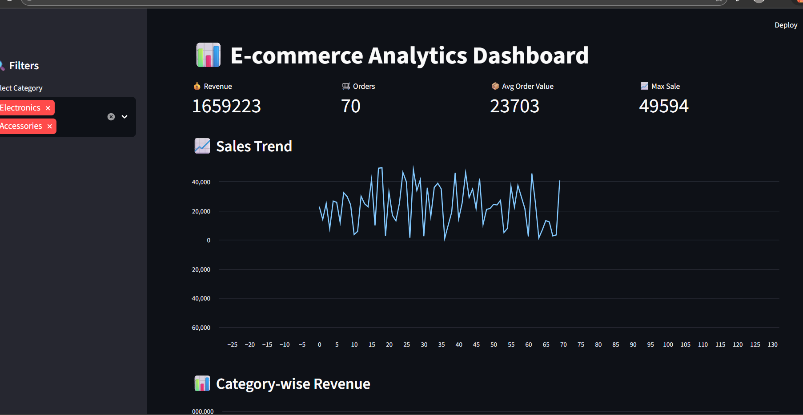
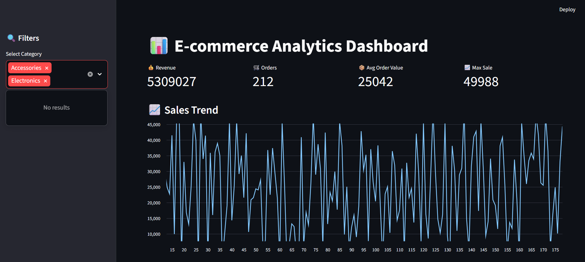
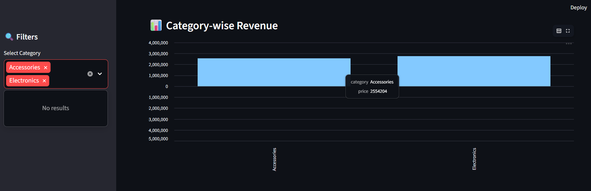
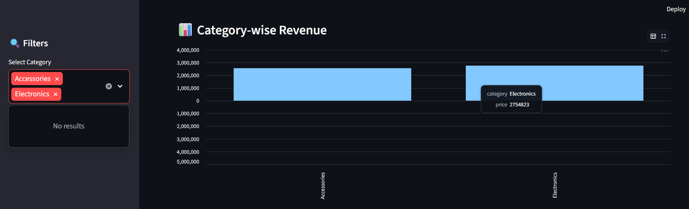
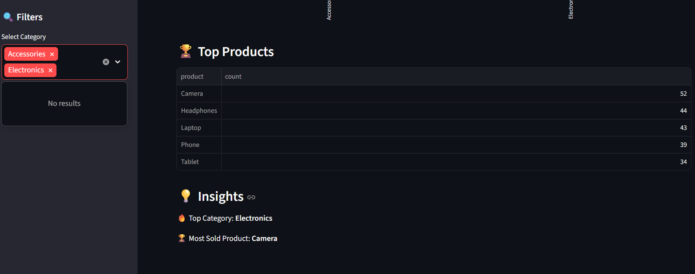

# 📊 E-commerce Analytics Dashboard

## 🚀 Project Overview
This project is a real-time e-commerce data analytics dashboard built using Python, SQLite, and Streamlit.

## 🔧 Technologies Used
- Python
- Pandas
- SQLite
- Streamlit
## 📸 Dashboard Screenshots


 📸 Dashboard Screenshots







These screenshots show:
- Overview of dashboard
- Revenue & profit trends
- Category-wise analysis
- Top-selling products
- Interactive charts

## 📊 Features
- Real-time data processing
- Revenue and Profit tracking
- Interactive dashboard
- Category-wise analysis
- Top product insights

## ▶️ How to Run
```bash
python stream.py
python -m streamlit run app.py

💼 About the Author

Mamatha M – Aspiring Data Analyst

Skilled in Python, Pandas, SQL, and data visualization
Passionate about building real-world analytics projects
Always looking to apply data-driven insights to business problems

Connect with me:

LinkedIn: [https://www.linkedin.com/in/mamatha-m-6b1728315?utm_source=share&utm_campaign=share_via&utm_content=profile&utm_medium=android_app]

Github:[https://github.com/dm6162192-prog]

